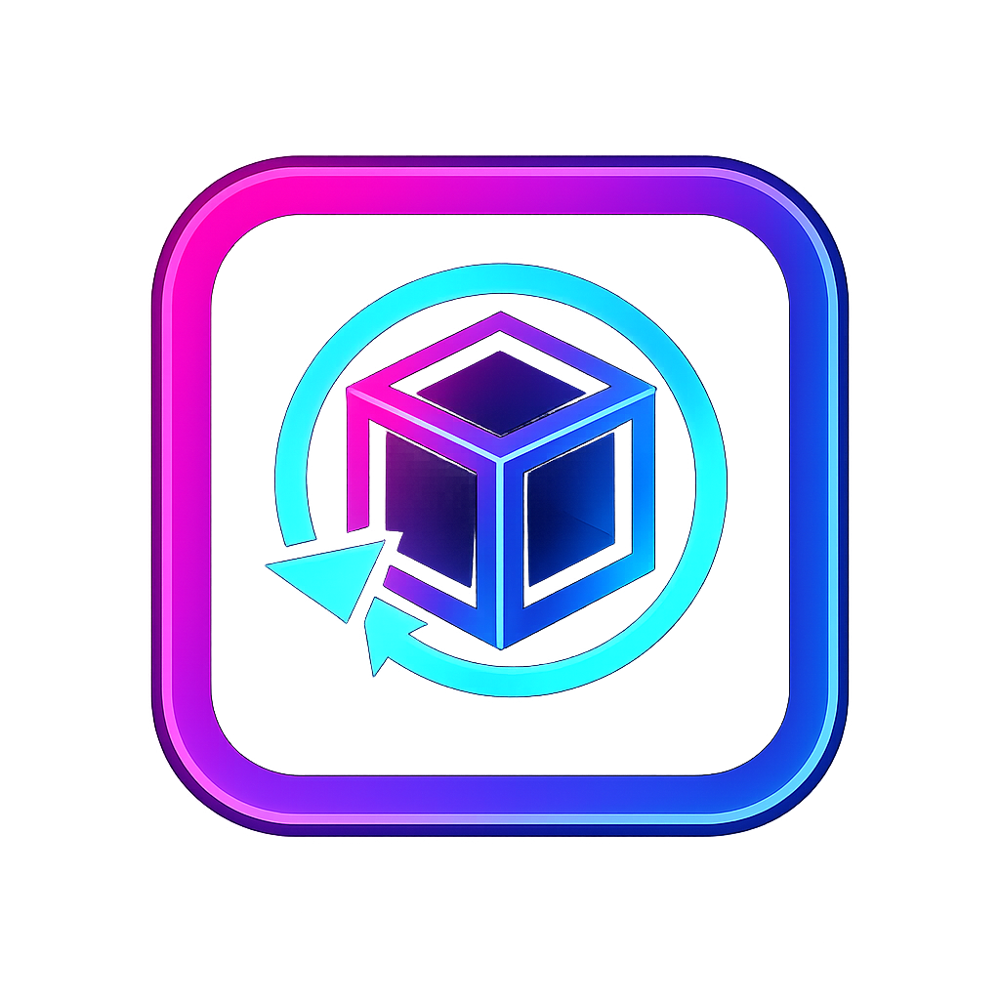

# DashDice Progress Sync Mod

Small Geode mod that syncs your Geometry Dash level progress to DashDice.

## What It Does
- Sends your `normal%`, `practice%`, and `attempts` after runs.
- Keeps a local queue and retries automatically if your server is offline.
- Supports API key auth for secure sync.

## Setup (Quick)
1. Install the `.geode` file in your Geometry Dash `geode/mods` folder.
2. Open mod settings in-game.
3. Set:
   - `Sync Endpoint`
   - `API Key`
4. Play and exit a level to sync progress.

## More Info
- Technical/build notes: [`DEVELOPER_NOTES.md`](./DEVELOPER_NOTES.md)
